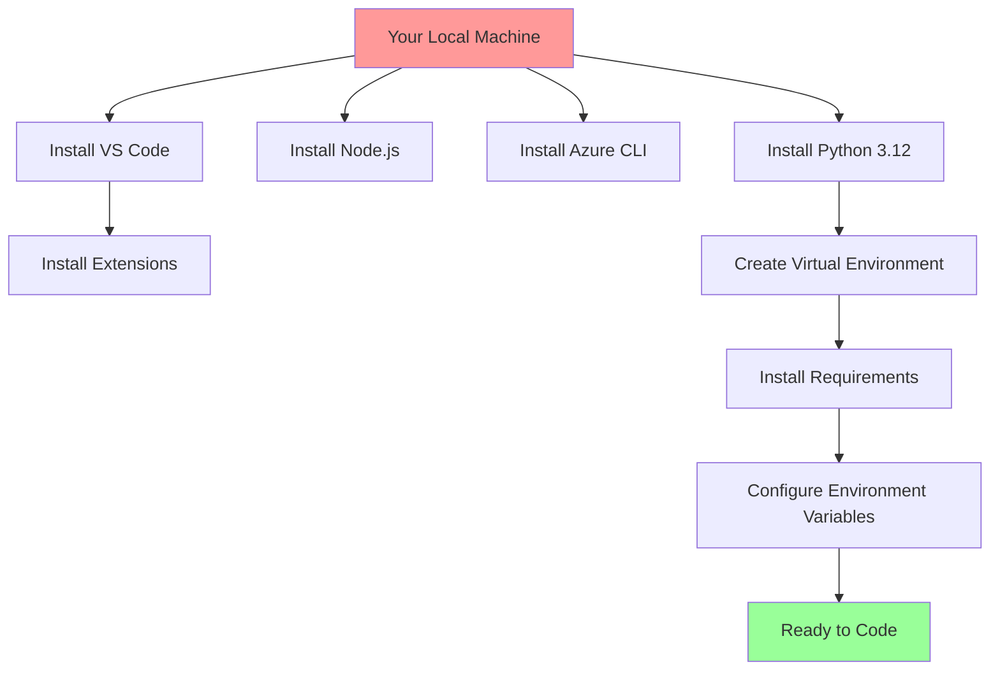
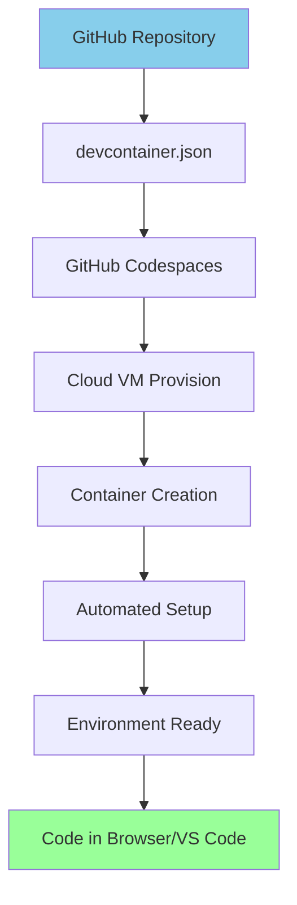

# Development Environments Architecture Guide

## Introduction

This guide explains the fundamental differences between local development setup and GitHub Codespaces setup for the AI Agents course, helping you understand the architecture, benefits, and trade-offs of each approach.

> 💡 **Development Environment as Code**: Just as we solved deployment consistency with containers for production, we now solve development environment consistency with dev containers and GitHub Codespaces.

## The Local Development Challenge

### Traditional Local Setup Problems

When developing AI agents locally, developers face several challenges:

```
┌─────────────────────────────────────┐
│           Local Machine             │
├─────────────────────────────────────┤
│ 🐍 Python 3.12                     │
│ 📦 pip/conda packages              │
│ 🔧 Azure CLI                       │
│ 🌐 Node.js (for MCP tools)         │
│ 💻 VS Code + Extensions            │
│ 🔑 API Keys & Environment Variables │
│ 📚 Course Dependencies             │
│ ⚙️  System Libraries               │
└─────────────────────────────────────┘
```

**Common Issues:**
- **Hours of setup time** installing Python, Node.js, Azure CLI, and dependencies
- **Version conflicts** between different projects
- **Environment pollution** as your machine accumulates tools from multiple projects
- **Platform inconsistencies** between Windows, macOS, and Linux
- **"Works on my machine"** syndrome when sharing code
- **Manual dependency management** and potential security vulnerabilities

### Local Setup Requirements

Following our [course setup guide](./README.md), you have two local options:

#### Option 1: Direct Installation
1. **Python 3.12+** with virtual environment management
2. **Package dependencies** via `pip install -r requirements.txt`
3. **VS Code** with Python, Jupyter, and Azure extensions
4. **Azure CLI** for Azure service authentication
5. **Node.js** for MCP (Model Context Protocol) tools
6. **Git configuration** and repository cloning
7. **API key management** through `.env` files

#### Option 2: Local Dev Containers (Recommended)
1. **Docker Desktop** - Required for running containers locally
   - **Windows**: Includes WSL 2 integration
   - **macOS**: Native Docker support
   - **Linux**: Docker Engine + Docker Compose
2. **WSL 2** (Windows only) - Linux subsystem for container compatibility
3. **VS Code** with Dev Containers extension
4. **Git** for repository access
5. **API key management** through `.env` files or environment variables

> 💡 **Why Dev Containers Locally?** Even on your local machine, dev containers provide consistency and isolation, preventing "works on my machine" issues when collaborating with others.

## Container-Based Development Architecture

> 🔍 **Visual Learner?** Check out our [Architecture Diagrams](./ARCHITECTURE_DIAGRAMS.md) for detailed visual representations of these concepts.

### The Container Solution

Just as containers solved the "works in dev, breaks in production" problem, **dev containers** solve the development environment consistency problem:

```
┌─────────────────────────────────────┐
│           Local Machine             │
├─────────────────────────────────────┤
│ 💻 VS Code + Dev Containers Ext    │
│ 🐳 Docker Desktop                  │
│ 🐧 WSL 2 (Windows only)           │
│ └─────────────────────────────────┐ │
│   │     Dev Container             │ │
│   ├───────────────────────────────┤ │
│   │ 🐍 Python 3.12               │ │
│   │ 📦 All Dependencies          │ │
│   │ 🔧 Azure CLI                 │ │
│   │ 🌐 Node.js                   │ │
│   │ ⚙️  Pre-configured Tools     │ │
│   │ 🔗 Port Forwarding          │ │
│   └───────────────────────────────┘ │
└─────────────────────────────────────┘
```

### How Dev Containers Work

1. **Definition**: A single `devcontainer.json` file describes the entire development environment
2. **Consistency**: Every developer gets the exact same environment
3. **Isolation**: No pollution of your local machine
4. **Portability**: Works identically across Windows, macOS, and Linux

```json
{
  "name": "AI Agents Course Dev Container",
  "image": "mcr.microsoft.com/devcontainers/python:3.12",
  "features": {
    "azure-cli": "latest",
    "conda": "latest"
  },
  "forwardPorts": [8000, 7860, 8888, 8501]
}
```

## GitHub Codespaces: Cloud-Powered Development

### Architecture Overview

GitHub Codespaces takes dev containers to the cloud, providing **development infrastructure as a service**:

```
┌─────────────────────────────────────┐
│           Your Browser/VS Code      │
├─────────────────────────────────────┤
│ 🌐 Remote Connection               │
│                                     │
│         ┌─────────────────────────┐ │
│         │    GitHub Codespaces    │ │
│         │                         │ │
│    ┌────▼─────────────────────────┐ │ │
│    │        Azure VM              │ │ │
│    ├──────────────────────────────┤ │ │
│    │ 🐧 Linux Kernel             │ │ │
│    │ ┌────────────────────────┐   │ │ │
│    │ │     Dev Container      │   │ │ │
│    │ ├────────────────────────┤   │ │ │
│    │ │ 🐍 Python 3.12 + Conda│   │ │ │
│    │ │ 📦 AI/ML Packages      │   │ │ │
│    │ │ 🔧 Azure CLI           │   │ │ │
│    │ │ 🌐 Node.js + MCP       │   │ │ │
│    │ │ 🔑 Secret Management   │   │ │ │
│    │ │ 🚀 Auto-configured     │   │ │ │
│    │ └────────────────────────┘   │ │ │
│    └──────────────────────────────┘ │ │
│         │                         │ │
│         └─────────────────────────┘ │
└─────────────────────────────────────┘
```

### Codespaces Benefits

1. **Zero Local Setup**: No software installation required on your machine
2. **Instant Environment**: Spin up a fully configured environment in 30-60 seconds
3. **Powerful Hardware**: Access to 2-core, 4-core, or 8-core cloud machines
4. **Persistent Storage**: Your work persists across sessions (30-day retention)
5. **Port Forwarding**: Easy access to running applications
6. **Secret Management**: Secure API key handling through GitHub Secrets

## Detailed Architecture Comparison

### Local Development Architecture



**Time Investment**: 1-3 hours initial setup + ongoing maintenance

### Codespaces Architecture



**Time Investment**: 30-60 seconds total setup

## Course-Specific Configurations

### Our Dev Container Configuration

The AI Agents course uses a sophisticated dev container setup:

```jsonc
{
  "name": "AI Agents Course Dev Container",
  "image": "mcr.microsoft.com/devcontainers/python:3.12",
  "features": {
    "azure-cli": "latest",
    "conda": {
      "channels": "conda-forge,defaults",
      "version": "latest"
    }
  },
  "customizations": {
    "vscode": {
      "extensions": [
        "ms-toolsai.jupyter",
        "ms-python.python",
        "ms-python.vscode-pylance",
        "GitHub.copilot"
      ]
    }
  },
  "forwardPorts": [8000, 7860, 8888, 8501],
  "postCreateCommand": "conda env create -f environment.yml"
}
```

### Automated Environment Setup

**Post-Create Script** (`post-create.sh`):
```bash
#!/bin/bash
# Runs once when container is created
echo "🚀 Setting up AI Agents environment..."

# Create conda environment with all dependencies
conda env create -f environment.yml
conda activate ai-agents

# Install Jupyter kernel
python -m ipykernel install --user --name ai-agents

echo "✅ Environment setup complete!"
```

**Post-Start Script** (`post-start.sh`):
```bash
#!/bin/bash
# Runs every time container starts
echo "🎯 Activating AI Agents environment..."

# Activate conda environment
conda activate ai-agents

# Verify environment
echo "📊 Environment Status:"
echo "Python: $(python --version)"
echo "Conda Environment: $CONDA_DEFAULT_ENV"

# Check for API keys
if [ -z "$GITHUB_TOKEN" ]; then
    echo "⚠️  Remember to set your GITHUB_TOKEN in Codespaces secrets!"
fi
```

## Port Forwarding and Application Access

### Local Development Ports

When running locally, applications bind to `localhost`:

```bash
# Jupyter runs on localhost:8888
jupyter lab --port 8888

# Chainlit apps on localhost:8000  
chainlit run app.py --port 8000

# Streamlit on localhost:8501
streamlit run app.py --port 8501
```

### Codespaces Port Forwarding

Codespaces automatically forwards and secures these ports:

```json
{
  "forwardPorts": [8000, 7860, 8888, 8501],
  "portsAttributes": {
    "8888": { 
      "label": "Jupyter Lab", 
      "onAutoForward": "openBrowser",
      "visibility": "private"
    },
    "8000": { 
      "label": "Chainlit Apps", 
      "onAutoForward": "openPreview"
    }
  }
}
```

**Port Visibility Options:**
- **Private**: Only you can access (default, secure)
- **Organization**: Team members can access
- **Public**: Anyone with the link can access

## Security and API Key Management

### Local Environment Security

```bash
# .env file (local only, not committed to git)
GITHUB_TOKEN=ghp_xxxxxxxxxxxx
AZURE_OPENAI_API_KEY=sk-xxxxxxxxxxxx
AZURE_OPENAI_ENDPOINT=https://your-resource.openai.azure.com/
```

**Risks:**
- API keys stored in plain text files
- Risk of accidentally committing keys to git
- Manual key rotation and management

### Codespaces Secret Management

GitHub Codespaces provides enterprise-grade secret management:

```
GitHub Settings → Codespaces → Secrets
├── GITHUB_TOKEN (encrypted, auto-injected)
├── AZURE_OPENAI_API_KEY (encrypted, auto-injected)  
├── AZURE_OPENAI_ENDPOINT (encrypted, auto-injected)
└── PROJECT_ENDPOINT (encrypted, auto-injected)
```

**Benefits:**
- **Encrypted storage** using GitHub's security infrastructure
- **Automatic injection** into container environment
- **Centralized management** across all your Codespaces
- **No risk of git commits** containing secrets
- **Team sharing** capabilities for organization secrets

## Performance and Resource Considerations

### Local Development Resources

Your local machine's performance directly impacts development:

```
┌─────────────────────────────────────┐
│        Your Local Hardware         │
├─────────────────────────────────────┤
│ 💾 RAM: Available system memory    │
│ 🖥️  CPU: Your processor cores      │
│ 💿 Storage: Local disk space       │
│ 🌐 Network: Your internet speed    │
│ 🔋 Battery: Laptop battery life    │
└─────────────────────────────────────┘
```

**Limitations:**
- Limited by your hardware specifications
- Battery drain during intensive AI model operations
- Potential thermal throttling
- Background processes competing for resources

### Codespaces Performance

Cloud-based resources optimized for development:

```
┌─────────────────────────────────────┐
│        GitHub Codespaces           │
├─────────────────────────────────────┤
│ 💾 RAM: 8GB, 16GB, or 32GB        │
│ 🖥️  CPU: 2, 4, or 8 cores          │
│ 💿 Storage: 32GB+ SSD              │
│ 🌐 Network: Azure datacenter speed │
│ ⚡ Power: Always plugged in        │
└─────────────────────────────────────┘
```

**Advantages:**
- **Predictable performance** regardless of your local hardware
- **High-speed internet** for package downloads and model inference
- **No battery drain** on your local device
- **Auto-pause** to save costs when not in use

## Cost Analysis

### Local Development Costs

```
Initial Setup: 1-3 hours of developer time
Ongoing Maintenance: 30 minutes/month
Hardware Requirements: Existing computer
Total Monthly Cost: $0 (after initial time investment)
```

### GitHub Codespaces Costs

**Free Tier (Personal accounts):**
- 120 core hours/month for 2-core machines
- 60 core hours/month for 4-core machines
- 30 core hours/month for 8-core machines

**Example Usage:**
```
2-core machine: $0.18/hour
4-core machine: $0.36/hour  
8-core machine: $0.72/hour

Typical course completion: 20-40 hours
Estimated cost: $7-29 for entire course
```

**Pro Accounts get 180 core hours/month included.**

## Course-Specific Advantages

### For AI Agents Development

**Local Development Challenges:**
- Large AI model downloads consuming local storage
- GPU/CPU intensive operations draining battery
- Network latency affecting API calls to Azure/GitHub
- Version conflicts with PyTorch, TensorFlow, etc.

**Codespaces Advantages:**
- **Pre-cached models** and dependencies in cloud storage
- **Optimal network connectivity** to Azure and GitHub APIs
- **Consistent CUDA/GPU** access (on supported tiers)
- **Isolated environments** preventing package conflicts

### Multi-Framework Support

The course uses three different AI frameworks:

```
1. Semantic Kernel + GitHub Models
   ├── .NET/Python SDK
   ├── OpenAI GPT models
   └── Azure integration

2. AutoGen + GitHub Models  
   ├── Multi-agent frameworks
   ├── Conversation patterns
   └── Group chat dynamics

3. Azure AI Foundry + Agent Service
   ├── Enterprise AI platform
   ├── Managed agent hosting
   └── Production deployment
```

**Codespaces Benefit**: All frameworks pre-configured and tested together.

## Migration Path and Best Practices

### When to Use Local Development

✅ **Good for:**
- Long-term development (40+ hours/month)
- Offline development requirements
- Custom hardware needs (specific GPUs)
- Cost-sensitive scenarios
- Learning system administration

### When to Use Codespaces

✅ **Good for:**
- Quick start and learning
- Consistent team environments
- CI/CD integration
- Teaching and workshops
- Temporary or experimental projects
- Travel and mobile development

### Hybrid Approach

Many developers use both:

```
📚 Learning Phase: Use Codespaces for quick start
🔨 Development Phase: Local for intensive work
🚀 Collaboration Phase: Codespaces for team sharing
📦 Production Phase: Local for deployment testing
```

## Troubleshooting Common Issues

### Local Development Issues

**Python Version Conflicts:**
```bash
# Use pyenv for Python version management
pyenv install 3.12
pyenv local 3.12
python -m venv ai-agents-env
```

**Package Installation Failures:**
```bash
# Clear pip cache and reinstall
pip cache purge
pip install -r requirements.txt --force-reinstall
```

**VS Code Extension Issues:**
```bash
# Reset VS Code Python interpreter
Cmd/Ctrl + Shift + P → "Python: Select Interpreter"
```

### Codespaces Issues

**Container Build Failures:**
- Check `.devcontainer/devcontainer.json` syntax
- Review build logs in Codespaces creation screen
- Ensure all referenced files exist

**Port Forwarding Issues:**
```bash
# Manual port forwarding
F1 → "Forward a Port" → Enter port number
```

**Environment Variable Issues:**
```bash
# Check environment variables
printenv | grep -E "(GITHUB_TOKEN|AZURE_)"

# Restart environment
source ~/.bashrc
```

## Future Considerations

### Emerging Technologies

**GitHub Codespaces Evolution:**
- Bigger machine types (16+ cores)
- GPU-enabled instances for AI/ML
- Prebuilt environments for faster startup
- Enhanced collaboration features

**Dev Container Standards:**
- Industry-wide adoption
- IDE-agnostic implementations
- Improved performance and caching
- Better integration with CI/CD

### Course Integration

As AI agents become more sophisticated, development environments will need:

- **Model fine-tuning capabilities** with GPU access
- **Distributed training** across multiple containers
- **Real-time collaboration** for multi-agent development
- **Production parity** for agent deployment testing

## Conclusion

Both local development and GitHub Codespaces have their place in AI agent development:

### Quick Comparison

| Aspect | Local Development | GitHub Codespaces |
|--------|------------------|-------------------|
| **Setup Time** | 1-3 hours | 30-60 seconds |
| **Cost** | Free (after setup) | $7-29 for course |
| **Performance** | Varies by hardware | Consistent, scalable |
| **Offline Work** | ✅ Available | ❌ Requires internet |
| **Team Consistency** | ❌ Manual alignment | ✅ Automatic |
| **Security** | Manual key management | Enterprise-grade |
| **Maintenance** | Ongoing updates needed | Automated |

### Recommendations

**For Course Students:**
- **Start with Codespaces** for immediate learning
- **Consider local** if planning extensive development
- **Use secrets management** regardless of choice

**For Course Instructors:**
- **Provide both options** to accommodate different needs
- **Emphasize Codespaces** for consistent support experience
- **Document troubleshooting** for both environments

The future of development is moving toward **development environments as code** - making the setup process predictable, repeatable, and shareable. Whether you choose local development or Codespaces, understanding these architectural differences will help you make informed decisions for your AI agent development journey.

---

**Ready to get started?** 
- [Try Codespaces](https://github.com/codespaces) for instant setup
- [Follow Local Setup](./README.md) for traditional development
- [Join our Discord](https://aka.ms/ai-agents/discord) for community support

🚀 Happy coding with AI Agents! 🤖
